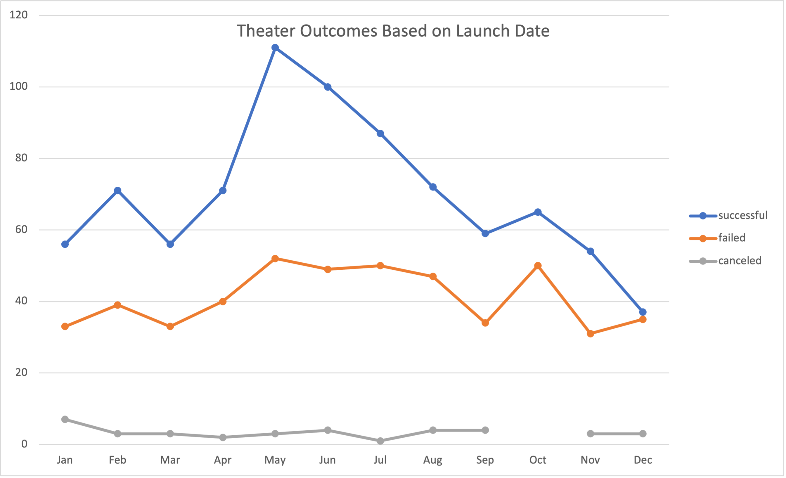

# Kickstarterone
new version of repo
# Kickstarting with Excel

## Overview of Project

	The purpose of this assignment was to become familiar with the fundamentals of Excel and how to use its powerful tools.  This project was an introduction to learn how to; filter large amounts of data, structure formulas and functions, creating pivot tables, as well as how to chart the information that is being presented. The Kickstarter project for our friend Louise provided plenty of data to utilize all the information within a spreadsheet.  This allowed us to learn how to use the features that excel can perform.  These will be new skill sets to add to my toolbox as a future data analyst. 

### Purpose

	The Purpose of this analysis was to help Louise make an informed decision on how to pursue her fundraising efforts for her play. 

## Analysis and Challenges
	### Analysis of Outcomes Based on Launch Date

       Based on the analysis of the information and what Louise was trying to find buried in all the data, she would be most successful launching a campaign during the springtime, between April Ð June.  With the highest possibility of success during May based on previous trends with other plays that have had Kickstarter fundraisers.  The graph below shows previous trends of theater campaigns. 

       
	 ### Analysis of Outcomes Based on Goals
       
       In addition, I would recommend setting the campaign goal to $4,999.  Previous play campaigns had seen the highest success rate in the dollar range of $0-4,999, with an average rate of success at 74.5%.  The chart below shows the trends based on goal amounts.

	
	### Challenges and Difficulties Encountered	

       While performing the analysis a challenge that I came across was structuring the function to filter the number of successful campaigns relative to their goals.  I overcame this by researching further how to correctly formulate that I am looking for amounts that are less than, greater than or equal for the dollar amounts.  Another challenge that I encountered was charting the outcomes based on goals.  When I initially selected the data, all the information was charted incorrectly.  I corrected the chart by figuring out how to select the data and inputting it on the proper axis. 

## Results

- What are two conclusions you can draw about the Outcomes based on Launch Date?

1. The best time to Launch a campaign would be in the spring, with the best chance of success in May. 

2. Campaigns launched during the fall and winter months saw the lowest success rate.

- What can you conclude about the Outcomes based on Goals?

Plays with a lower campaign goals, in the dollar range of $0-4,999 were most successful.

- What are some limitations of this dataset?

	A limitation could be that this data does not show if plays were successful based on number of ticket sales. Or which genre pulls a larger audience such as musical, drama, comedy, romanceÉ etc. 

- What are some other possible tables and/or graphs that we could create?

	We could create a chart that compares campaigns in different countries to get an idea if certain demographics prefer theaters and plays.  With this we could begin to understand if there are additional markets try to fundraise in or even try to sell the play in different areas. 

